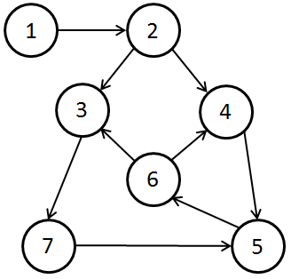
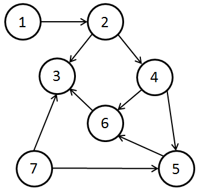
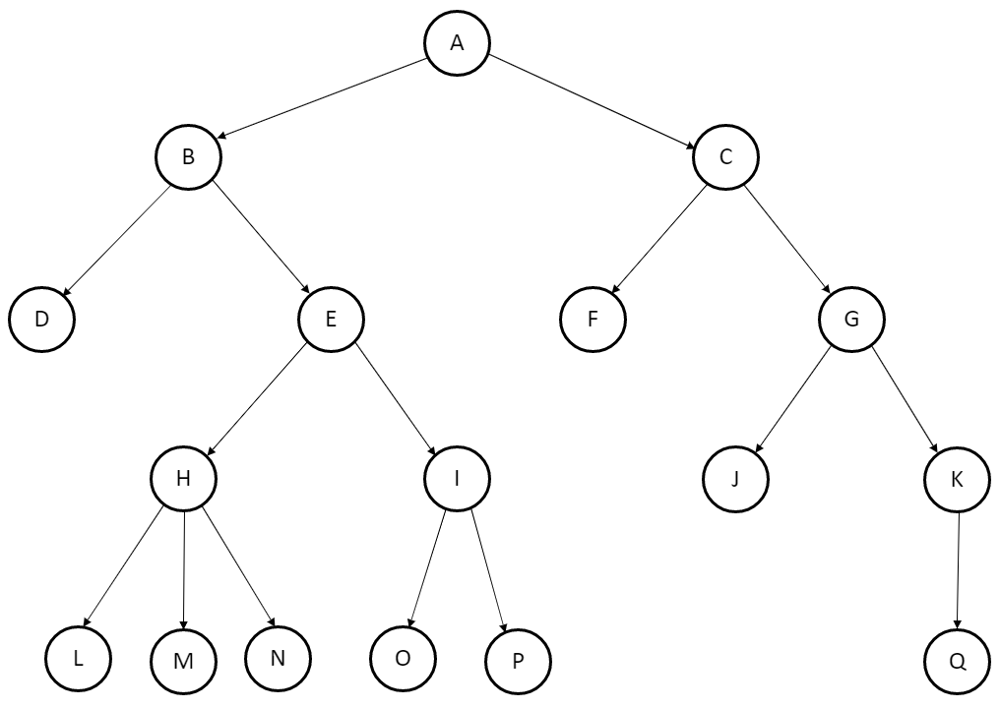

# Directed graph

## Definition
[Wikipedia - Directed graph](https://en.wikipedia.org/wiki/Directed_graph)

## Examples
### The following graph is not acyclic and node 1 has a path to any other node in the graph:



```ts
import { DirectedGraph, CDanNode, CDanArc } from 'dangraph';
const myGraph = new DirectedGraph.DanDirectedGraph<number, undefined>();

myGraph.addArcToNode(new CDanNode({ id: 1 }), new CDanArc({ weight: 1, node: new CDanNode({ id: 2 }) }), DirectedGraph.ArcType.outgoing);
myGraph.addArcToNode(new CDanNode({ id: 2 }), new CDanArc({ weight: 1, node: new CDanNode({ id: 3 }) }), DirectedGraph.ArcType.outgoing);
myGraph.addArcToNode(new CDanNode({ id: 2 }), new CDanArc({ weight: 1, node: new CDanNode({ id: 4 }) }), DirectedGraph.ArcType.outgoing);
myGraph.addArcToNode(new CDanNode({ id: 4 }), new CDanArc({ weight: 1, node: new CDanNode({ id: 5 }) }), DirectedGraph.ArcType.outgoing);
myGraph.addArcToNode(new CDanNode({ id: 5 }), new CDanArc({ weight: 1, node: new CDanNode({ id: 6 }) }), DirectedGraph.ArcType.outgoing);
myGraph.addArcToNode(new CDanNode({ id: 4 }), new CDanArc({ weight: 1, node: new CDanNode({ id: 6 }) }), DirectedGraph.ArcType.incoming);
myGraph.addArcToNode(new CDanNode({ id: 6 }), new CDanArc({ weight: 1, node: new CDanNode({ id: 3 }) }), DirectedGraph.ArcType.outgoing);
myGraph.addArcToNode(new CDanNode({ id: 5 }), new CDanArc({ weight: 1, node: new CDanNode({ id: 7 }) }), DirectedGraph.ArcType.incoming);
myGraph.addArcToNode(new CDanNode({ id: 3 }), new CDanArc({ weight: 1, node: new CDanNode({ id: 7 }) }), DirectedGraph.ArcType.outgoing);

console.log(myGraph.toString());
if (myGraph.isAcyclic()) {
  console.log('The graph is acyclic');
} else {
  console.log('The graph is not acyclic');
}

if (myGraph.sourceConnectedToAllNodes(1)) {
  console.log('Node 1 has a path to any other node in the graph');
} else {
  console.log('Node 1 does not have a path to any other node in the graph');
}
```

### The following graph is acyclic and node 1 does not have a path to node 7



```ts
import { DirectedGraph, CDanNode, CDanArc } from 'dangraph';
const myGraph = new DirectedGraph.DanDirectedGraph<number, undefined>();

myGraph.addArcToNode(new CDanNode({ id: 1 }), new CDanArc({ weight: 1, node: new CDanNode({ id: 2 }) }), DirectedGraph.ArcType.outgoing);
myGraph.addArcToNode(new CDanNode({ id: 2 }), new CDanArc({ weight: 1, node: new CDanNode({ id: 3 }) }), DirectedGraph.ArcType.outgoing);
myGraph.addArcToNode(new CDanNode({ id: 2 }), new CDanArc({ weight: 1, node: new CDanNode({ id: 4 }) }), DirectedGraph.ArcType.outgoing);
myGraph.addArcToNode(new CDanNode({ id: 4 }), new CDanArc({ weight: 1, node: new CDanNode({ id: 5 }) }), DirectedGraph.ArcType.outgoing);
myGraph.addArcToNode(new CDanNode({ id: 5 }), new CDanArc({ weight: 1, node: new CDanNode({ id: 6 }) }), DirectedGraph.ArcType.outgoing);
myGraph.addArcToNode(new CDanNode({ id: 4 }), new CDanArc({ weight: 1, node: new CDanNode({ id: 6 }) }), DirectedGraph.ArcType.outgoing);
myGraph.addArcToNode(new CDanNode({ id: 6 }), new CDanArc({ weight: 1, node: new CDanNode({ id: 3 }) }), DirectedGraph.ArcType.outgoing);
myGraph.addArcToNode(new CDanNode({ id: 5 }), new CDanArc({ weight: 1, node: new CDanNode({ id: 7 }) }), DirectedGraph.ArcType.incoming);
myGraph.addArcToNode(new CDanNode({ id: 3 }), new CDanArc({ weight: 1, node: new CDanNode({ id: 7 }) }), DirectedGraph.ArcType.incoming);

console.log(myGraph.toString());
if (myGraph.isAcyclic()) {
  console.log('The graph is acyclic');
} else {
  console.log('The graph is not acyclic');
}

if (myGraph.sourceConnectedToAllNodes(1)) {
  console.log('Node 1 has a path to any other node in the graph');
} else {
  console.log('Node 1 does not have a path to any other node in the graph');
}
```

### Depth-First and Breadth-First iterators



```ts
import { DirectedGraph, CDanNode, CDanArc } from 'dangraph';
const myGraph = new DirectedGraph.DanDirectedGraph<string, undefined>();

// 'A' -> 'B'
myGraph.addArcToNode(new CDanNode({ id: 'A' }), new CDanArc({ weight: 1, node: new CDanNode({ id: 'B' }) }), DirectedGraph.ArcType.outgoing);
// 'A' -> 'C'
myGraph.addArcToNode(new CDanNode({ id: 'A' }), new CDanArc({ weight: 1, node: new CDanNode({ id: 'C' }) }), DirectedGraph.ArcType.outgoing);
// 'B' -> 'D'
myGraph.addArcToNode(new CDanNode({ id: 'B' }), new CDanArc({ weight: 1, node: new CDanNode({ id: 'D' }) }), DirectedGraph.ArcType.outgoing);
// 'B' -> 'E'
myGraph.addArcToNode(new CDanNode({ id: 'B' }), new CDanArc({ weight: 1, node: new CDanNode({ id: 'E' }) }), DirectedGraph.ArcType.outgoing);
// 'C' -> 'F'
myGraph.addArcToNode(new CDanNode({ id: 'C' }), new CDanArc({ weight: 1, node: new CDanNode({ id: 'F' }) }), DirectedGraph.ArcType.outgoing);
// 'C' -> 'G'
myGraph.addArcToNode(new CDanNode({ id: 'C' }), new CDanArc({ weight: 1, node: new CDanNode({ id: 'G' }) }), DirectedGraph.ArcType.outgoing);
// 'E' -> 'H'
myGraph.addArcToNode(new CDanNode({ id: 'E' }), new CDanArc({ weight: 1, node: new CDanNode({ id: 'H' }) }), DirectedGraph.ArcType.outgoing);
// 'E' -> 'I'
myGraph.addArcToNode(new CDanNode({ id: 'E' }), new CDanArc({ weight: 1, node: new CDanNode({ id: 'I' }) }), DirectedGraph.ArcType.outgoing);
// 'G' -> 'J'
myGraph.addArcToNode(new CDanNode({ id: 'G' }), new CDanArc({ weight: 1, node: new CDanNode({ id: 'J' }) }), DirectedGraph.ArcType.outgoing);
// 'G' -> 'K'
myGraph.addArcToNode(new CDanNode({ id: 'G' }), new CDanArc({ weight: 1, node: new CDanNode({ id: 'K' }) }), DirectedGraph.ArcType.outgoing);
// 'H' -> 'L'
myGraph.addArcToNode(new CDanNode({ id: 'H' }), new CDanArc({ weight: 1, node: new CDanNode({ id: 'L' }) }), DirectedGraph.ArcType.outgoing);
// 'H' -> 'M'
myGraph.addArcToNode(new CDanNode({ id: 'H' }), new CDanArc({ weight: 1, node: new CDanNode({ id: 'M' }) }), DirectedGraph.ArcType.outgoing);
// 'H' -> 'N'
myGraph.addArcToNode(new CDanNode({ id: 'H' }), new CDanArc({ weight: 1, node: new CDanNode({ id: 'N' }) }), DirectedGraph.ArcType.outgoing);
// 'I' -> 'O'
myGraph.addArcToNode(new CDanNode({ id: 'I' }), new CDanArc({ weight: 1, node: new CDanNode({ id: 'O' }) }), DirectedGraph.ArcType.outgoing);
// 'I' -> 'P'
myGraph.addArcToNode(new CDanNode({ id: 'I' }), new CDanArc({ weight: 1, node: new CDanNode({ id: 'P' }) }), DirectedGraph.ArcType.outgoing);
// 'K' -> 'Q'
myGraph.addArcToNode(new CDanNode({ id: 'K' }), new CDanArc({ weight: 1, node: new CDanNode({ id: 'Q' }) }), DirectedGraph.ArcType.outgoing);

const depthFirstIt = myGraph.getDepthFirstIterator('A');
let dfFinalString = '';
while (depthFirstIt.hasNext()) {
  const node = depthFirstIt.next();
  if (node !== undefined) {
    dfFinalString += node.id;
  }
}
// dfFinalString will be: 'ABDEHLMNIOPCFGJKQ'

const breadthFirstIt = myGraph.getBreadthFirstIterator('A');
let bfFinalString = '';
while (breadthFirstIt.hasNext()) {
  const node = breadthFirstIt.next();
  if (node !== undefined) {
    bfFinalString += node.id;
  }
}
// bfFinalString will be: 'ABCDEFGHIJKLMNOPQ'
```
